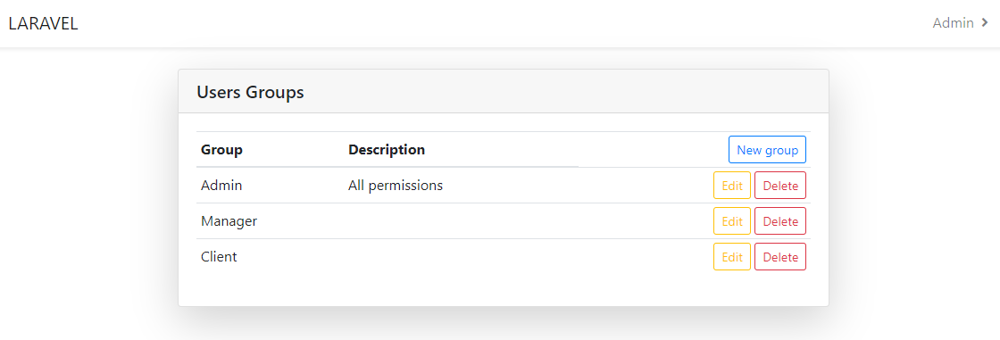

# Docblock ACL para Laravel 5.5+

Este pacote para laravel usa os docblocks nas ações dos controladores para definir permissões de acesso
em todo seu sistema.

[English docs](README_en.md)

<br>

## Instalação

Use o composer

```bash
composer require tjgazel/laravel-docblock-acl
```

<br>

Após instalação ter sido concluída, rode o comando abaixo.

```bash
php artisan vendor:publish --provider="TJGazel\LaravelDocBlockAcl\AclServiceProvider"
```

Este comando irá fazer as seguintes alterações:

-   Adicionar o arquivo de configuração `acl.php` no diretório `config`.
-   Adicionar as migrações para o ACL.
-   Adicionar um arquivo de seeder para a tabela groups.
-   Adicionar as views do ACL em `resources/views/vendor/acl`.
-   Adicionar os aquivos de tradução em `resources/lang/vendor/acl/en` e `resources/lang/vendor/acl/pt-BR`.

Como alternativa você pode publicar cada etapa de forma individual usando o comando `php artisan publish` e selecionando a respectiva opção na lista.

<br>

## Configurações

Abra o arquivo `config/acl.php` e configure o namespace correto para sua model `User`.

```php
return [
    'model' => [
        'user' => '\App\User',
        'group' => '\TJGazel\LaravelDocBlockAcl\Models\Group',
        'permission' => '\TJGazel\LaravelDocBlockAcl\Models\Permission'
    ]
];
```

### Migrations e seeder

Será criado as tabelas no banco de dados e adicionado uma chave estrangeira (group_id) na tabela Users conforme o esquema da figura abaixo.


```bash
php artisan migrate
```

```bash
php artisan db:seed --class=GroupsTableSeeder
```

> Se a sua tabela Users já tiver algum registro de usuário, deverá associar um grupo para ele.

### Models

No model `User`, implemente a interface `UserAclContract`. Adicione também a trait `UserAcltrait`.

```php
// ....
use TJGazel\LaravelDocBlockAcl\Models\Contracts\UserAclContract;
use TJGazel\LaravelDocBlockAcl\Models\traits\UserAcltrait;

class User extends Authenticatable implements UserAclContract
{
    use Notifiable, UserAcltrait;
}
```

### Middleware

Abra o arquivo `app/Http/Kernel.php` e adicione o middleware ACL.

```php
protected $routeMiddleware = [
    //...
    'acl' => \TJGazel\LaravelDocBlockAcl\Http\Middleware\AclMiddleware::class,
];
```

### Rotas para manutenção do ACL

Adicione em seu arquivo de rotas Api ou Web a função abaixo. As rotas irão responder de acordo com o tipo de solicitação. Lembre-se que ACL funciona em conjunto com o login. Assumimos então que você já tenha instalado o sistema padrão de login do laravel usado `php artisan make:auth`

```php
// web.php
Auth::routes();

Acl::routes();
```

A função de rotas aceita um array opcional de configurações para fácil personalização do prefixo, nome e middlewares padrões da rota. Por padrão ele usa o seguinte modelo.

```php
Acl::routes([
    'middleware' => ['auth', 'acl'],
    'prefix' => 'acl',
    'name' => 'acl.'
]);
```

> **Importante:**
> Como é obvio, no primeiro momento não exite uma atribuição das permissões para determinado grupo. A configuração das rotas `Acl::routes()` , aplica o middleware acl por padrão conforme mostrado acima, sendo assim, será impossível acessá-las sem desativar monetanteamente esse middleware. Para isso passe o parâmetro opcional conforme mostrado abaixo.

```php
Acl::routes([
    'middleware' => []
]);
```

Não esqueça de voltar o padrão após atribuição das permissões aos grupos essenciais.

**Lista das rotas ACL** <br>
Podem ser personalizadas com prefix, name e middleware conforme mostrado acima.

| Method | URI                  | Name        | Controller                                                         | Middleware |
| ------ | -------------------- | ----------- | ------------------------------------------------------------------ | ---------- |
| GET    | /acl                 | acl.index   | \TJGazel\LaravelDocBlockAcl\Http\Controllers\AclController@index   | auth,acl   |
| POST   | /acl                 | acl.store   | \TJGazel\LaravelDocBlockAcl\Http\Controllers\AclController@store   | auth,acl   |
| GET    | /acl/create          | acl.create  | \TJGazel\LaravelDocBlockAcl\Http\Controllers\AclController@create  | auth,acl   |
| GET    | /acl/{group_id}/edit | acl.edit    | \TJGazel\LaravelDocBlockAcl\Http\Controllers\AclController@edit    | auth,acl   |
| PUT    | /acl/{group_id}      | acl.update  | \TJGazel\LaravelDocBlockAcl\Http\Controllers\AclController@update  | auth,acl   |
| DELETE | /acl/{group_id}      | acl.destroy | \TJGazel\LaravelDocBlockAcl\Http\Controllers\AclController@destroy | auth,acl   |

### Protegendo rotas com ACL

> **Observação:**
> Antes de proteger suas rotas, faça o mapeamentos dos grupos e permissões nos controllers e através da rota (por padrão) `/acl` , atribua as permissões aos tipos de usuários. Veja na sessão [Modo de uso](#Modo-de-uso)

Basta agrupar suas rotas com o middleware ACL.

```php
Route::middleware(['auth', 'acl'])->group(function() {
    //...
});
```

### Views

As views ACL extendem o template criado pelo comando `php artisan make:auth`. Você pode edita-las a seu gosto. Elas se encomtram em `resources/views/vendor/acl`.

`http://localhost:8000/acl`


`http://localhost:8000/1/edit`


<br>

## Modo de uso

> **Observação:**
> O ACL funciona em conjunto com autenticação, portando você só deve mapear as ações dos controladores que estiverem protegidas pelos middlewares `auth`, `auth:api` ou outro personalizado.

### Mapeando grupo de permissões

Em seus controllers utilize docblocs com a tag `@permissionResource('Nome do grupo')`.

```php
/**
 * @permissionResource('Pages')
 */
class PageController extends Controller
{
    //...
}
```

### Mapeando nome das permissões

Nas ações (methods) do controller utilize a tag `@permissionName('Nome da permissão')`

```php
    /**
     * @permissionName('Form - edit')
     */
    public function edit($id)
    {
        //...
    }

    /**
     * @permissionName('Update')
     */
    public function update()
    {
        //...
    }
```

> Varios controllers podem usar o mesmo nome de grupo **(@permissionResource('Pages'))**. Isto fará com que as permissões de todos os controladores que contenham a mesma tag, sejam mostradas na view de forma agrupada, mas tenha atenção em colisão de nomes nas tag das permissões **(@permissionName('Nome da permissão'))**.
